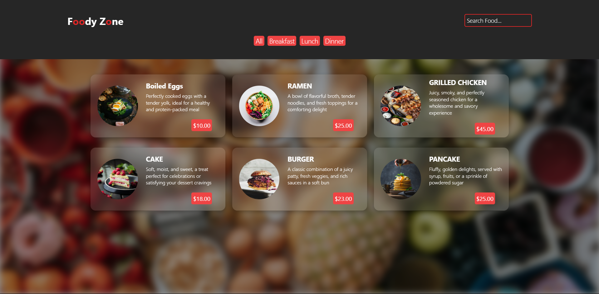

# Foody Zone - Landing Page

This is a static landing page for the "Foody Zone" food website. It showcases various dishes with their descriptions and prices in a visually appealing manner. The project is built using **React** and **Tailwind CSS**.

## Feature
- **Dynamic Styling**: Tailwind CSS for modern and customizable UI.

## Screenshots




## Tech Stack

- **Frontend**: React
- **Styling**: Tailwind CSS

## Installation

1. Clone the repository:
   ```bash
   git clone https://github.com/SniperXyZ011/Food-zone-Landing.git
   ```

2. Navigate to the project directory:
   ```bash
   cd foody-zone-landing-page
   ```

3. Install dependencies:
   ```bash
   npm install
   ```

4. Start the development server:
   ```bash
   npm start
   ```

5. Open your browser and visit `http://localhost:3000` to view the landing page.

## Project Structure

```plaintext
src/
├── assets/            # Images and static assets
├── components/        # Reusable React components
├── styles/            # Custom CSS or Tailwind configurations
├── App.js             # Main App component
├── index.js           # Entry point
└── ...
```


## Future Enhancements

- Add animations for transitions and hover effects.
- Implement a backend to fetch dish details dynamically.
- Add user authentication and cart functionality.


## License

This project is licensed under the [MIT License](LICENSE).

---

Feel free to customize the README as per your project needs!

